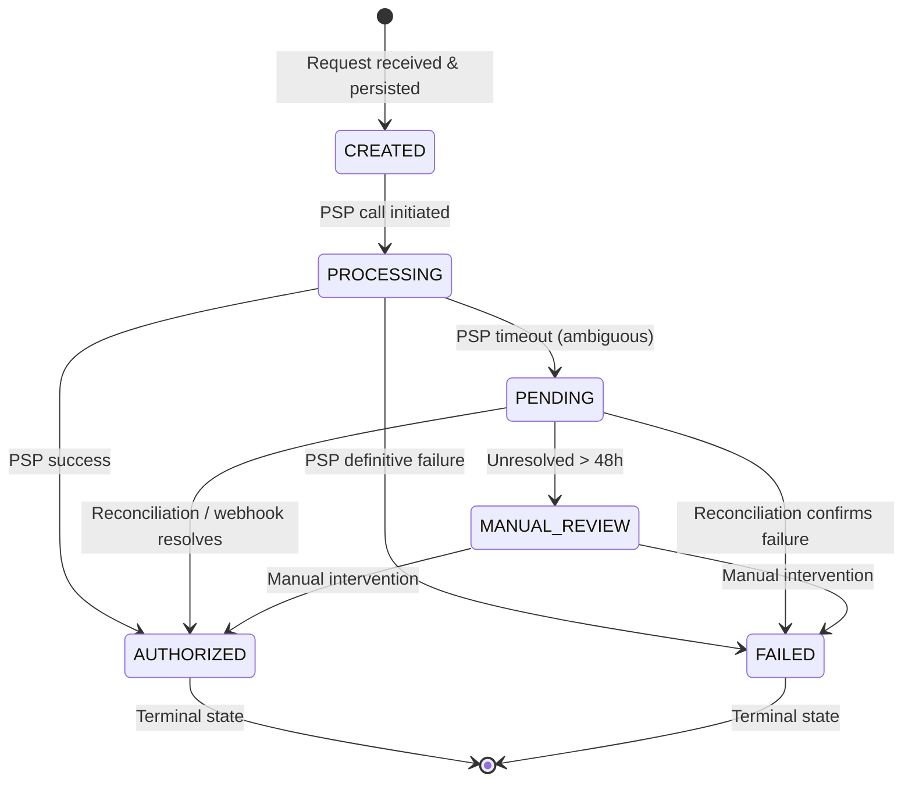
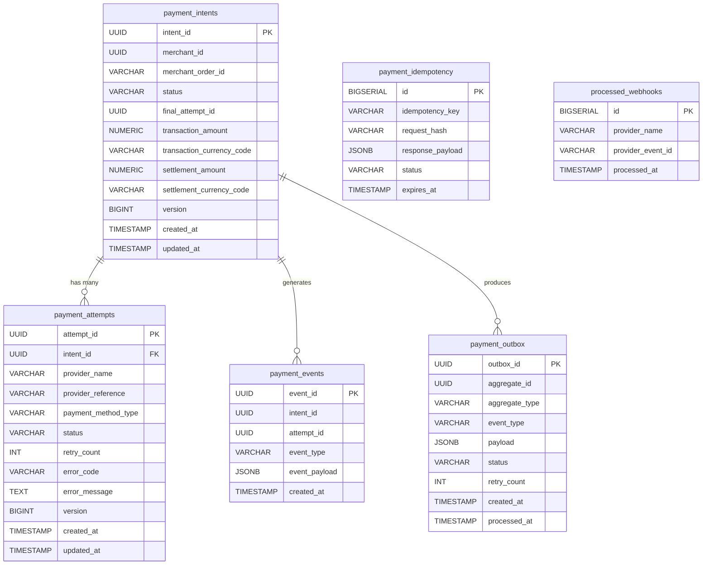

# Payment Orchestration Service — Architecture

A production-grade payment authorization orchestrator built in Java 21 / Spring Boot 3.3.  
Handles PSP routing, retry management, idempotency enforcement, reconciliation, provider failover, and asynchronous recovery.

**Scope:** Authorization lifecycle only. Settlement, ledgering, capture, refund, and acquiring workflows are explicitly out of scope.

---

## Table of Contents

1. [System Overview Diagram](#system-overview-diagram)
2. [Payment Lifecycle State Machine](#payment-lifecycle-state-machine)
3. [Synchronous Authorization Flow](#synchronous-authorization-flow)
4. [Async Recovery Architecture](#async-recovery-architecture)
5. [Transaction Boundary Diagram](#transaction-boundary-diagram)
6. [Database Entity Relationship](#database-entity-relationship)
7. [Security Model](#security-model)
8. [Component Inventory](#component-inventory)
9. [Configuration Reference](#configuration-reference)
10. [Architectural Decisions & Trade-offs](#architectural-decisions--trade-offs)

---

## System Overview Diagram

```
┌─────────────────────────────────────────────────────────────────────────┐
│                        Payment Orchestrator                             │
│                                                                         │
│  ┌────────────┐   ┌───────────────────────────────────────────────┐    │
│  │ Client /   │   │           Validation Pipeline                  │    │
│  │ Merchant   │──▶│  Schema → Auth → Replay → Idempotency → Biz   │    │
│  │ Backend    │   └──────────────────────┬────────────────────────┘    │
│  └────────────┘                          │                              │
│                                          ▼                              │
│                          ┌───────────────────────────┐                 │
│                          │   Atomic DB Transaction    │                 │
│                          │   INSERT payment_intent    │                 │
│                          │   INSERT payment_attempt   │                 │
│                          │   INSERT payment_event     │                 │
│                          │   INSERT payment_outbox    │◀── COMMIT      │
│                          └──────────────┬────────────┘                 │
│                                         │ (PSP call only after COMMIT) │
│                                         ▼                              │
│                          ┌───────────────────────────┐                 │
│                          │      Routing Engine        │                 │
│                          │  CARD → PSP_A              │                 │
│                          │  UPI  → PSP_B              │                 │
│                          └──────────────┬────────────┘                 │
│                                         │                              │
│                          ┌──────────────▼────────────┐                 │
│                          │   PSP Connector           │                 │
│                          │  ┌──────────────────────┐ │                 │
│                          │  │ Circuit Breaker       │ │                 │
│                          │  │ Immediate Retry       │ │                 │
│                          │  │ Failover (CB open)    │ │                 │
│                          │  └──────────────────────┘ │                 │
│                          └──────────────┬────────────┘                 │
│                                         │                              │
│         ┌───────────────────────────────┼────────────────────────┐    │
│         ▼                               ▼                          ▼    │
│   SUCCESS                          TIMEOUT                      FAILED  │
│   → AUTHORIZED                     → PENDING                  → FAILED │
│         │                               │                              │
│         │                    ┌──────────▼──────────────────────────┐   │
│         │                    │         Async Recovery Workers       │   │
│         │                    │  ┌─────────────────────────────┐    │   │
│         │                    │  │ Reconciliation Worker (45s)  │    │   │
│         │                    │  │ Retry Worker (exp. backoff)  │    │   │
│         │                    │  │ Webhook Processor            │    │   │
│         │                    │  └─────────────────────────────┘    │   │
│         │                    └─────────────────────────────────────┘   │
│         │                                                              │
│         ▼                                                              │
│  ┌──────────────┐   ┌─────────────┐   ┌───────────────────────────┐   │
│  │  PostgreSQL  │   │   Redis 7   │   │  Kafka / InMemoryPublisher │   │
│  │  (state +    │   │  (nonces +  │   │  (event publication)       │   │
│  │   audit)     │   │   replay    │   │                            │   │
│  │              │   │   protect.) │   │                            │   │
│  └──────────────┘   └─────────────┘   └───────────────────────────┘   │
└─────────────────────────────────────────────────────────────────────────┘
```

---

## Payment Lifecycle State Machine



### Intent Status Meanings

| Status | Description |
|--------|-------------|
| `CREATED` | Intent persisted, PSP call not yet dispatched |
| `PROCESSING` | PSP authorization request in-flight |
| `AUTHORIZED` | Issuer has reserved funds. **Not yet settled.** |
| `FAILED` | Definitive, non-recoverable failure |
| `PENDING` | Outcome uncertain — async resolution in progress |
| `MANUAL_REVIEW` | Unresolved >48h, requires human intervention |

### Attempt Status Meanings

| Status | Description |
|--------|-------------|
| `PROCESSING` | PSP call in-flight for this attempt |
| `AUTHORIZED` | This attempt succeeded |
| `FAILED` | This attempt definitively failed |
| `PENDING` | This attempt timed out, outcome unknown |
| `SUPERSEDED` | A later retry succeeded; this attempt is superseded |

> **AUTHORIZED ≠ SETTLED.** Authorization reserves funds at the issuer.  
> Actual settlement happens through card network / acquirer rails and is **out of scope**.

---

## Synchronous Authorization Flow

```
 Merchant Backend
       │
       │ POST /api/v1/payments-orchestration/payments
       │ Headers: X-Request-Id, X-Correlation-Id, X-Timestamp,
       │          X-Nonce, X-Signature, Idempotency-Key
       │
       ▼
┌─────────────────────────────────────────────────────┐
│  1. Schema Validation                               │
│     - Required fields, UUID formats, amount > 0    │
│     - payment_method_type ∈ {CARD, UPI}            │
│     - Fail fast → 400                              │
└─────────────────────────┬───────────────────────────┘
                          │
                          ▼
┌─────────────────────────────────────────────────────┐
│  2. Security Validation                             │
│     - X-Timestamp within ±5 minutes → 401          │
│     - X-Nonce unique in Redis TTL window → 401     │
│     - X-Signature HMAC-SHA256 verify → 401         │
│     - X-Request-Id present → 400                   │
└─────────────────────────┬───────────────────────────┘
                          │
                          ▼
┌─────────────────────────────────────────────────────┐
│  3. Idempotency Check                               │
│     - Lookup by Idempotency-Key                    │
│     - Same key + same canonical SHA-256 → CACHED   │
│     - Same key + different hash → 409 CONFLICT     │
│     - New key → create PROCESSING record           │
└─────────────────────────┬───────────────────────────┘
                          │
                          ▼
┌─────────────────────────────────────────────────────┐
│  4. Business Validation                             │
│     - Merchant active                              │
│     - Currency pair supported                      │
│     - merchant_order_id unique per merchant        │
│     - Amount above minimum threshold               │
└─────────────────────────┬───────────────────────────┘
                          │
                          ▼
┌─────────────────────────────────────────────────────┐
│  5. Atomic DB Transaction (TX 1)                    │
│     INSERT payment_intents   (status=PROCESSING)   │
│     INSERT payment_attempts  (status=PROCESSING)   │
│     INSERT payment_events    (PAYMENT_CREATED)     │
│     INSERT payment_outbox    (status=PENDING)      │
│                          COMMIT                    │
└─────────────────────────┬───────────────────────────┘
                          │
                          │ PSP call only after commit
                          ▼
┌─────────────────────────────────────────────────────┐
│  6. Routing Engine                                  │
│     CARD → PSP_A connector                         │
│     UPI  → PSP_B connector                         │
│     Circuit Breaker check → failover if OPEN       │
└─────────────────────────┬───────────────────────────┘
                          │
                          ▼
┌─────────────────────────────────────────────────────┐
│  7. PSP Authorization Call                          │
│     Connect timeout: ~3s | Read timeout: ~10s      │
│     ┌────────────────────────────────────────┐     │
│     │ SUCCESS → PspResponse(SUCCESS, ref)    │     │
│     │ FAILURE → PspResponse(FAILED, null)    │     │
│     │ TIMEOUT → PspTimeoutException          │     │
│     │ CB Open → CallNotPermittedException    │     │
│     └────────────────────────────────────────┘     │
└─────────────────────────┬───────────────────────────┘
                          │
                          ▼
┌─────────────────────────────────────────────────────┐
│  8. Outcome Update (TX 2)                           │
│     SUCCESS → intent=AUTHORIZED, attempt=AUTHORIZED│
│     FAILURE → intent=FAILED, attempt=FAILED        │
│     TIMEOUT → intent=PENDING, attempt=PENDING      │
│     UPDATE payment_outbox to reflect final status  │
└─────────────────────────┬───────────────────────────┘
                          │
                          ▼
┌─────────────────────────────────────────────────────┐
│  9. Idempotency Cache Update                        │
│     Status=COMPLETED, response_payload=JSON        │
└─────────────────────────┬───────────────────────────┘
                          │
                          ▼
                     HTTP Response
               200 AUTHORIZED / 200 FAILED / 202 ACCEPTED
```

---

## Async Recovery Architecture

```
                    payment_outbox (status=PENDING)
                           │
                    ┌──────▼───────┐
                    │ Outbox       │ every 1500ms
                    │ Publisher    │ SELECT FOR UPDATE SKIP LOCKED
                    │ Worker       │ batch: 50 rows
                    └──────┬───────┘
                           │ publish
                           ▼
               ┌───────────────────────┐
               │  EventPublisher       │
               │  (Kafka in prod)      │
               │  (InMemory in local)  │
               └───────────┬───────────┘
                           │ mark PROCESSED
                           ▼
                   outbox row updated

━━━━━━━━━━━━━━━━━━━━━━━━━━━━━━━━━━━━━━━━━━━━━━━━━━━━━━━━━━━
Reconciliation Worker                              every 45s
━━━━━━━━━━━━━━━━━━━━━━━━━━━━━━━━━━━━━━━━━━━━━━━━━━━━━━━━━━━
  payment_intents WHERE status='PENDING'
  SELECT FOR UPDATE SKIP LOCKED
          │
          ▼
  For each PENDING intent:
  ┌────────────────────────────────────────────┐
  │ Age ≥ 48h → escalate to MANUAL_REVIEW     │
  │ Age ≥ 24h → emit operational alert        │
  │ Query PSP status API                       │
  │   SUCCESS → intent=AUTHORIZED             │
  │   FAILED  → intent=FAILED                 │
  │   PENDING → check retry eligibility       │
  │     retry-safe → enqueue to RetryWorker   │
  └────────────────────────────────────────────┘

━━━━━━━━━━━━━━━━━━━━━━━━━━━━━━━━━━━━━━━━━━━━━━━━━━━━━━━━━━━
Retry Worker                                      every 2s
━━━━━━━━━━━━━━━━━━━━━━━━━━━━━━━━━━━━━━━━━━━━━━━━━━━━━━━━━━━
  payment_intents WHERE status='PENDING' (retry-eligible)
  SELECT FOR UPDATE SKIP LOCKED
          │
          ▼
  Check max attempts (≤5):
  ┌────────────────────────────────────────────┐
  │ Attempts ≥ 5 → intent=FAILED (DLQ)        │
  │ Otherwise:                                 │
  │   1. TX 1: Create new attempt (PROCESSING) │
  │   2. PSP authorization call               │
  │   3. TX 2: Resolve outcome                 │
  │      SUCCESS → AUTHORIZED + old SUPERSEDED│
  │      TIMEOUT → PENDING again              │
  │      FAILED  → FAILED                     │
  └────────────────────────────────────────────┘
  Exponential backoff: base * 2^retry_count
  Capped at max_backoff_ms

━━━━━━━━━━━━━━━━━━━━━━━━━━━━━━━━━━━━━━━━━━━━━━━━━━━━━━━━━━━
Webhook Processor
━━━━━━━━━━━━━━━━━━━━━━━━━━━━━━━━━━━━━━━━━━━━━━━━━━━━━━━━━━━
  POST /api/v1/payments-orchestration/webhooks/{provider}
          │
          ▼
  1. Validate provider (PSP_A or PSP_B)
  2. Verify X-PSP-Signature (HMAC-SHA256)
  3. Deduplication: check processed_webhooks(provider, event_id)
  4. Correlate: findByProviderReference(provider_reference)
  5. Validate state transition via PaymentLifecycleValidator
  6. Apply transition
  7. Persist: processed_webhook + payment_event + payment_outbox
```

---

## Transaction Boundary Diagram

```
┌────────────────────────────────────────────────────────────┐
│                   Transaction TX-1                          │
│  (PaymentOrchestrationService.createInitialPaymentState)   │
│                                                            │
│  INSERT payment_intents   (status = PROCESSING)           │
│  INSERT payment_attempts  (status = PROCESSING)           │
│  INSERT payment_events    (event_type = PAYMENT_CREATED)  │
│  INSERT payment_outbox    (status = PENDING)              │
│                                        ▲                  │
│                                     COMMIT                 │
└──────────────────────────┬─────────────────────────────────┘
                           │
         ┌─────────────────▼────────────────────────┐
         │        PSP CALL (outside transaction)     │
         └─────────────────┬────────────────────────┘
                           │
┌──────────────────────────▼─────────────────────────────────┐
│                   Transaction TX-2                          │
│  (PaymentOrchestrationService.updatePaymentOutcome)        │
│                                                            │
│  UPDATE payment_attempts   (status = AUTHORIZED/FAILED/…) │
│  UPDATE payment_intents    (status = AUTHORIZED/FAILED/…) │
│  INSERT payment_events     (PAYMENT_AUTHORIZED / FAILED)  │
│  INSERT payment_outbox     (PAYMENT_AUTHORIZED event)     │
│                                        ▲                  │
│                                     COMMIT                 │
└────────────────────────────────────────────────────────────┘
```

> **Rule:** No PSP call ever occurs inside a database transaction.  
> If the PSP authorizes but TX-2 fails, reconciliation will resolve the discrepancy.

---

## Database Entity Relationship



### Index Strategy

| Index | Table | Columns | Purpose |
|-------|-------|---------|---------|
| `idx_intent_status` | `payment_intents` | `status` | Reconciliation/retry worker polling |
| `idx_attempt_intent` | `payment_attempts` | `intent_id` | JOIN on intent |
| `idx_attempt_provider_ref` | `payment_attempts` | `provider_reference` | Webhook correlation |
| `idx_outbox_pending` | `payment_outbox` | `(status, created_at)` | Outbox polling (partial on PENDING) |
| `idx_events_intent` | `payment_events` | `intent_id` | Audit queries |
| `uq_merchant_order` | `payment_intents` | `(merchant_id, merchant_order_id)` | Order deduplication |
| `uq_idempotency_key` | `payment_idempotency` | `idempotency_key` | Idempotency lookup |
| `uq_provider_event` | `processed_webhooks` | `(provider_name, provider_event_id)` | Webhook deduplication |

---

## Security Model

### Request Validation Pipeline

```
Incoming Request
      │
      ▼
 [X-Request-Id present?] ─── NO ──▶ 400 MISSING_REQUEST_ID
      │ YES
      ▼
 [X-Timestamp ± 5 min?] ─── NO ──▶ 401 TIMESTAMP_INVALID
      │ YES
      ▼
 [X-Nonce unique in Redis?] ── NO ──▶ 401 NONCE_REUSED + audit log
      │ YES (write nonce to Redis, TTL 600s)
      ▼
 [X-Signature valid HMAC?] ── NO ──▶ 401 INVALID_SIGNATURE
      │ YES
      ▼
 [Idempotency-Key present?] ─ NO ──▶ 400 VALIDATION_ERROR
      │ YES
      ▼
 Business Validation
```

### HMAC Signature Canonical String

```
canonical_string =
  HTTP_METHOD + "\n" +
  REQUEST_PATH + "\n" +
  SHA256(canonical_json_body) + "\n" +
  X-Timestamp + "\n" +
  X-Nonce + "\n" +
  merchant_id

signature = Base64(HMAC_SHA256(merchant_secret, canonical_string))
```

### Nonce Replay Protection

Redis key: `nonce:{merchant_id}:{nonce}`  
TTL: 600 seconds (10 minutes)

| Risk | Mitigation |
|------|-----------|
| Redis restart opens replay window | Redis persistence enabled (AOF + RDB) |
| Single Redis node failure | Replicated topology (Sentinel or Cluster) |
| Cache miss after failover | Short timestamp window limits blast radius |
| Audit gap during Redis outage | Replay audit log written to Postgres, not Redis |

---

## Component Inventory

### API Layer

| Component | Package | Description |
|-----------|---------|-------------|
| `PaymentController` | `controller` | POST /payments, GET /payments/{id}, GET /payments/{id}/status |
| `WebhookController` | `controller` | POST /webhooks/{provider} |
| `GlobalExceptionHandler` | `exception` | Maps all exceptions to structured JSON error responses |

### Service Layer

| Component | Package | Description |
|-----------|---------|-------------|
| `PaymentOrchestrationFlowManagerImpl` | `service` | End-to-end authorization orchestrator |
| `PaymentOrchestrationServiceImpl` | `service` | Atomic DB operations (TX-1, TX-2) |
| `IdempotencyServiceImpl` | `service` | Idempotency key lifecycle management |
| `ReconciliationServiceImpl` | `service` | PSP status query + state resolution |
| `RetryServiceImpl` | `service` | Safe retry execution with backoff |
| `WebhookServiceImpl` | `service` | Webhook validation, deduplication, transition |
| `PaymentLifecycleValidator` | `service` | State transition matrix enforcement |
| `RoutingEngine` | `service` | PSP selection logic |
| `PspErrorClassifier` | `service` | Error code → retry safety classification |

### PSP Connectors

| Component | Description |
|-----------|-------------|
| `PspAConnector` | Simulated PSP_A (CARD). Mode: SUCCESS/FAILURE/TIMEOUT via config |
| `PspBConnector` | Simulated PSP_B (UPI). Mode: SUCCESS/FAILURE/TIMEOUT via config |
| `PspConnector` | Interface — interchangeable with real HTTP connectors |

### Background Workers

| Component | Schedule | Description |
|-----------|----------|-------------|
| `OutboxPublisherWorker` | 1500ms | Polls payment_outbox, publishes events |
| `ReconciliationWorker` | 45000ms | Polls PENDING intents, queries PSP status |
| `RetryWorker` | 2000ms | Executes safe retries with exponential backoff |

### Infrastructure

| Component | Description |
|-----------|-------------|
| `InMemoryEventPublisher` | Local/test event publisher (Profile: `local`, `test`) |
| `DatabaseHealthIndicator` | Actuator: SELECT 1 health check with latency |
| `RedisHealthIndicator` | Actuator: PING + INFO, reports version/mode/uptime |
| `KafkaHealthIndicator` | Actuator: Kafka admin client health check |
| `MaskingUtils` | Sensitive data masking for log output |
| `SecurityUtils` | HMAC-SHA256, SHA-256 hex, JSON canonicalization |

---

## Configuration Reference

```yaml
# application.yml — key configuration points

orchestrator:
  idempotency:
    ttl-hours: 24                        # Idempotency key TTL

  replay-protection:
    timestamp-window-minutes: 5          # ±5 min request timestamp drift
    nonce-window-minutes: 10             # Nonce uniqueness window

  workers:
    outbox-publisher:
      interval-ms: 1500                  # Outbox polling interval
      batch-size: 50                     # Rows per cycle
    reconciliation:
      interval-ms: 45000                 # Reconciliation poll interval
      alert-threshold-hours: 24          # Alert if pending > 24h
      manual-review-threshold-hours: 48  # MANUAL_REVIEW if pending > 48h
    retry:
      interval-ms: 2000                  # Retry worker poll interval
      base-backoff-ms: 1000              # Exponential backoff base
      max-backoff-ms: 300000             # 5 minutes max backoff
      max-attempts: 5                    # DLQ after 5 attempts

  routing:
    CARD: PSP_A
    UPI: PSP_B

  psp:
    psp-a:
      mode: SUCCESS                      # LOCAL: SUCCESS|FAILURE|TIMEOUT
      webhook-secret: secret_psp_a
    psp-b:
      mode: SUCCESS
      webhook-secret: secret_psp_b

  security:
    key-rotation:
      grace-period-minutes: 60
```

---

## Architectural Decisions & Trade-offs

### ADR-1: Synchronous Authorization, Asynchronous Recovery Only

**Decision:** Initial PSP authorization is synchronous. Recovery (reconciliation, retry, webhook) is asynchronous.

**Rationale:** Payment authorization is customer-facing and latency-sensitive. A fully queue-driven pipeline introduces unacceptable eventual consistency, retry ambiguity, and double-charge risk.

**Trade-off:** The synchronous PSP call is on the critical path. A slow PSP directly increases API response time. Mitigated by per-provider timeout budgets, circuit breakers, and PENDING as the safe fallback.

---

### ADR-2: PENDING not FAILED on Timeout

**Decision:** PSP read timeout → `PENDING`. Never `FAILED`.

**Rationale:** A network timeout cannot distinguish "the PSP failed to process" from "the PSP processed but the response was lost." Marking `FAILED` risks incorrect state. More importantly, retrying on ambiguous timeout risks double-charging the customer if the original authorization succeeded and only the response transmission failed.

**Trade-off:** Merchants must handle PENDING state and poll or await webhooks. This adds merchant integration complexity but is the only correct distributed behavior.

---

### ADR-3: Three-Entity Domain Model vs Full Event Sourcing

**Decision:** Separate `payment_intents` (business state) + `payment_attempts` (execution) + `payment_events` (audit), rather than full event sourcing.

**Rationale:** Full event sourcing adds significant operational complexity (event store management, projection rebuilding, snapshot strategies) not justified at this scale. The three-table model provides replayability and auditability without the overhead.

**Trade-off:** State is mutable in `payment_intents`. The immutable audit trail lives in `payment_events` but is not the primary state resolution source.

---

### ADR-4: Polling Outbox vs CDC (Debezium)

**Decision:** Polling-based outbox publisher (1500ms interval) rather than Change Data Capture.

**Rationale:** CDC requires WAL access, Debezium infrastructure, and significantly more operational complexity. At the expected event volume (<500 TPS), a 1–2 second polling lag is acceptable.

**Trade-off:** 1–2 second lag between DB commit and event publication. Acceptable for async recovery. CDC is the upgrade path for lower-latency requirements.

---

### ADR-5: Optimistic Locking + SKIP LOCKED for Concurrency

**Decision:** `version` column on mutable entities for optimistic locking; `SELECT FOR UPDATE SKIP LOCKED` on all background worker batch queries.

**Rationale:** Prevents lost updates from concurrent webhooks, reconciliation, and retry workers without deadlocking under high throughput.

**Trade-off:** Occasional `OptimisticLockException` under high concurrent writes, handled by retry at the application layer.

---

*See [`master_context.md`](./master_context.md) for the authoritative system specification and non-negotiable architectural rules.*