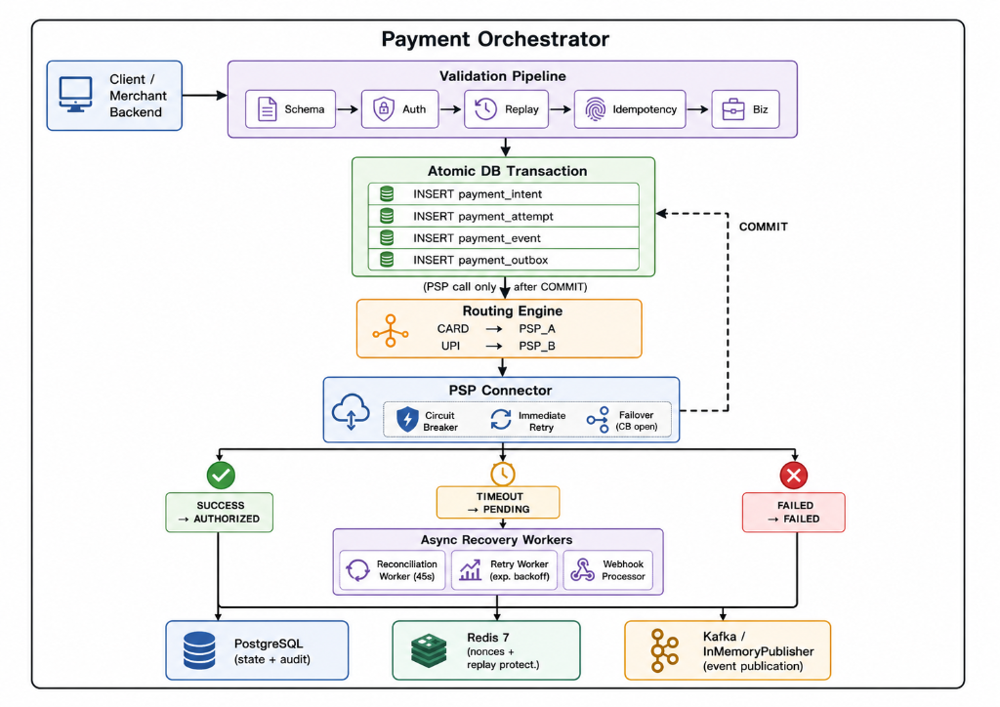
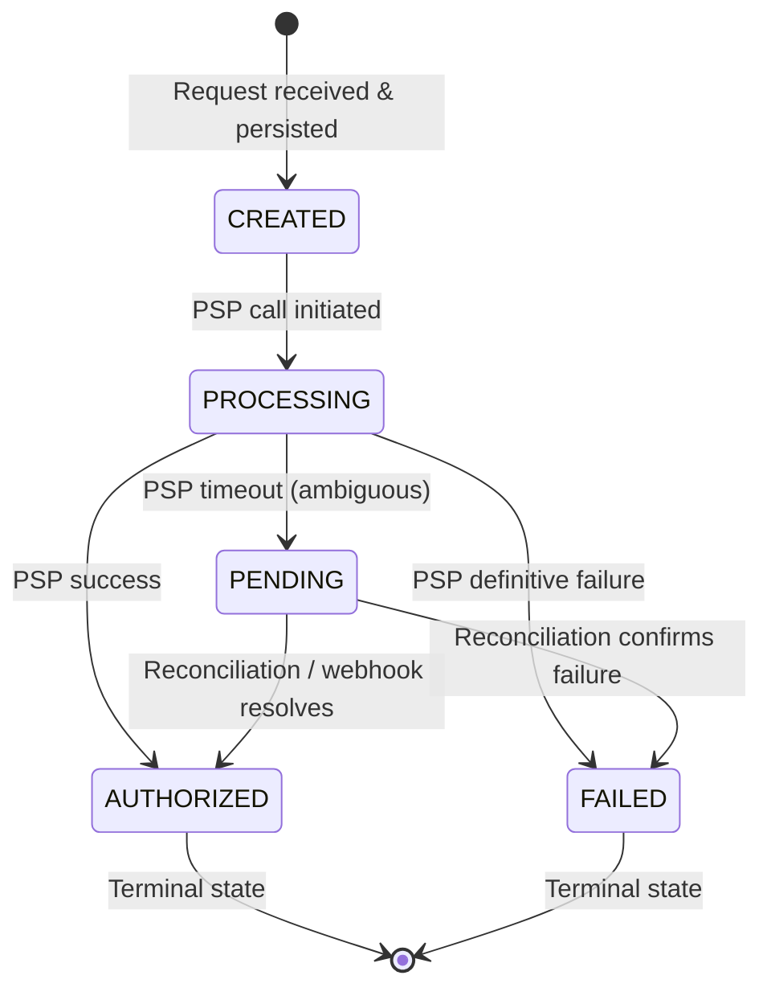
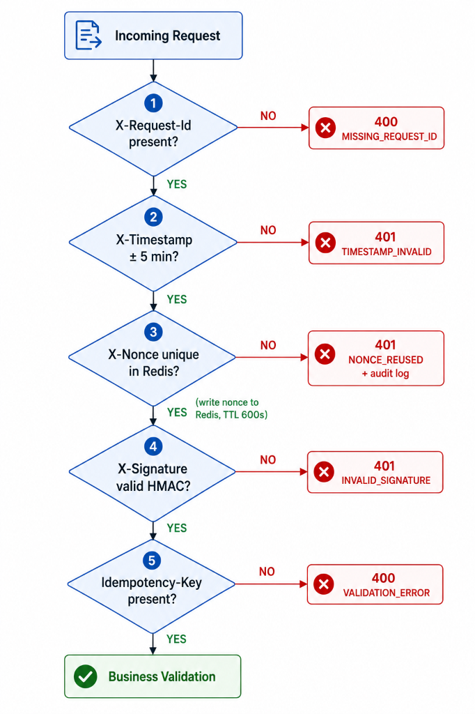
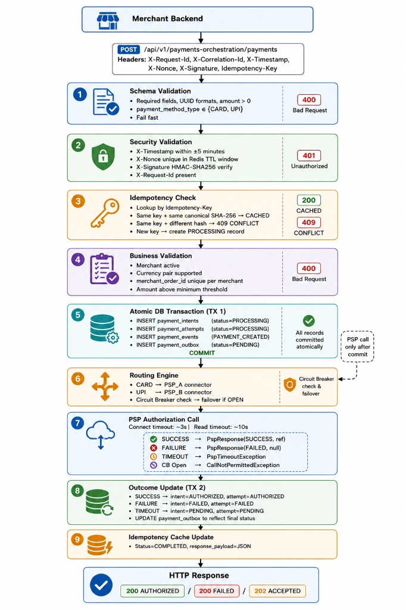
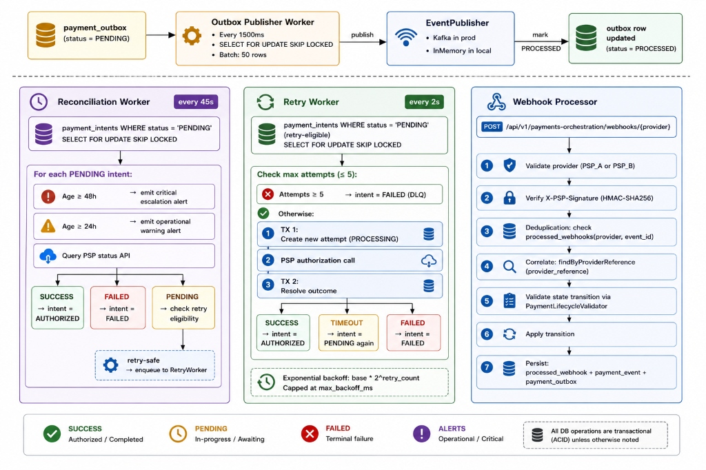
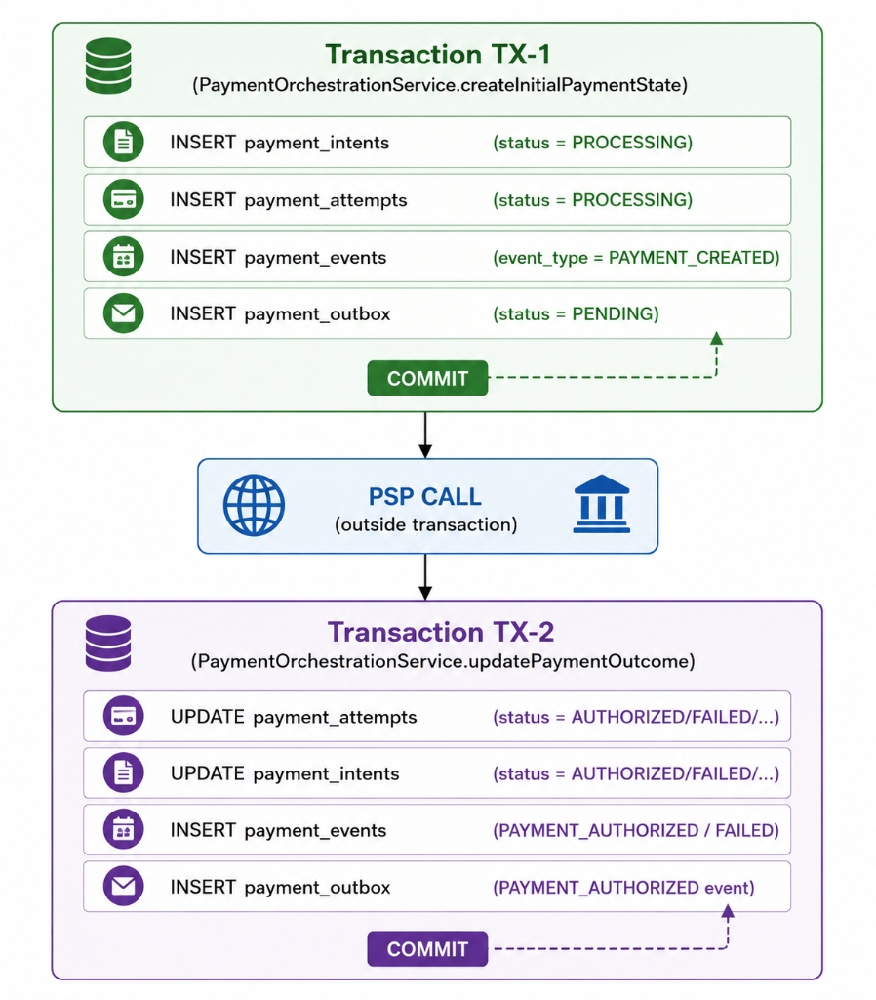
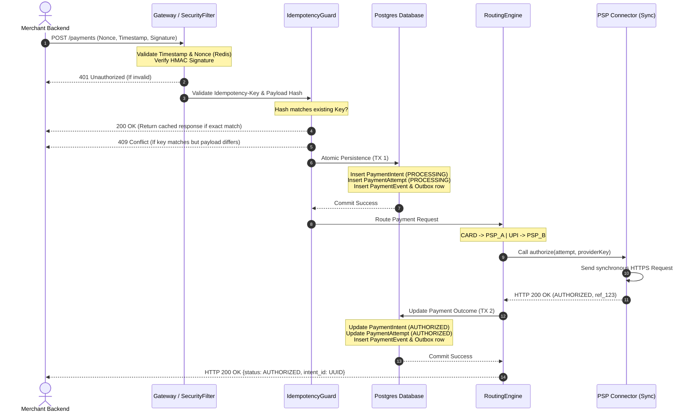
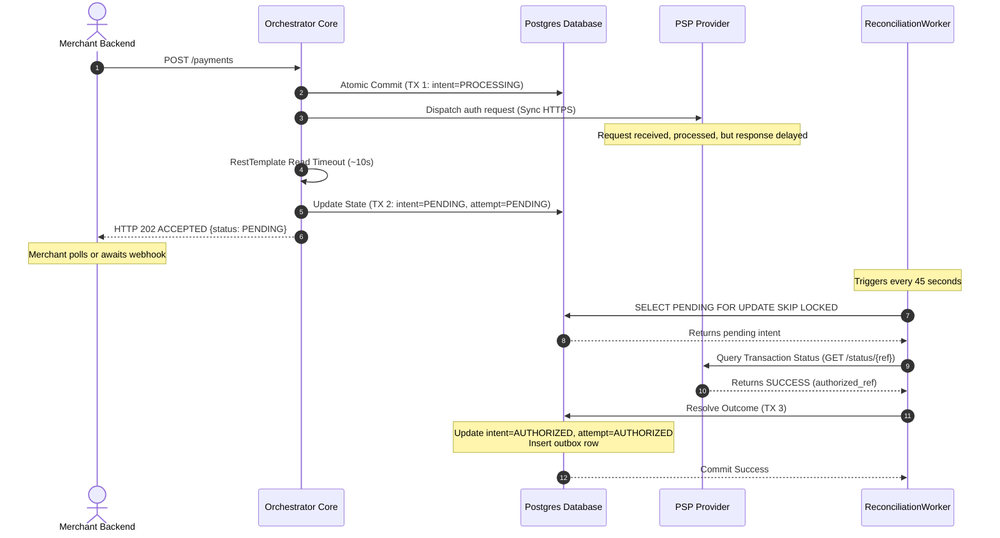
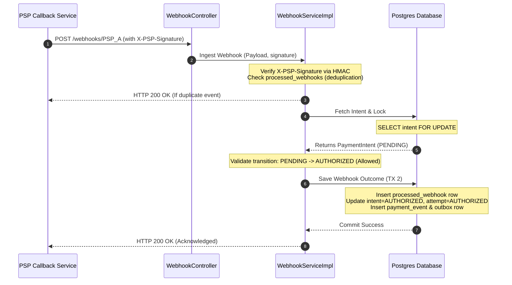
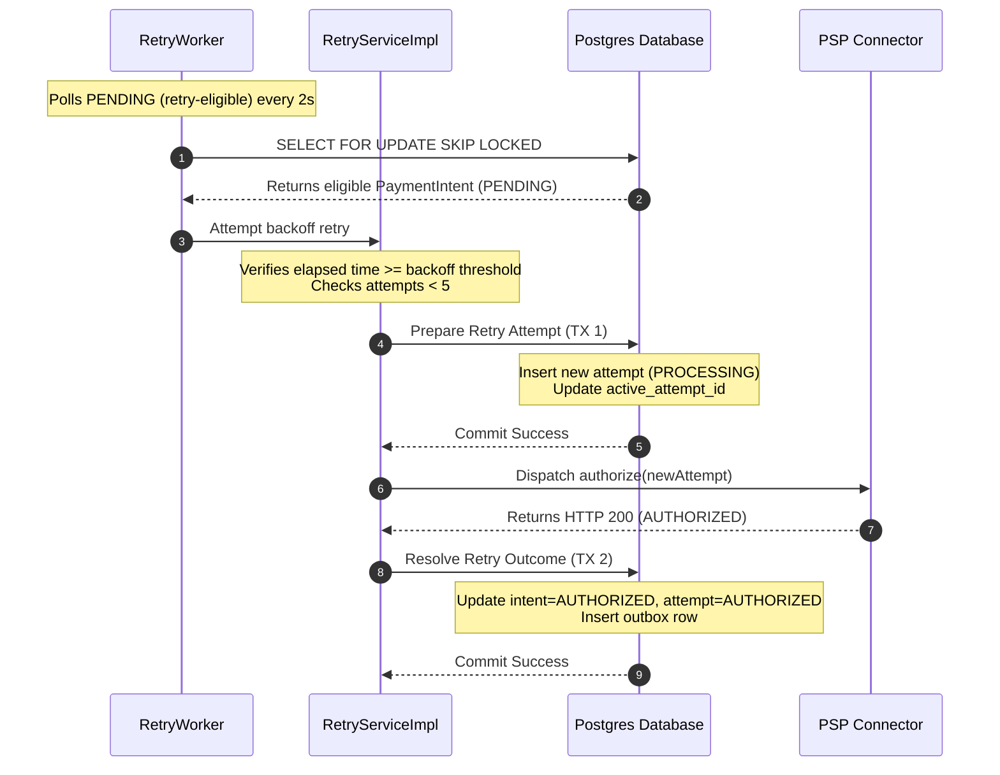

# Payment Orchestration Service — Architecture

A production-grade payment authorization orchestrator built in Java 21 / Spring Boot 3.3.  
Handles PSP routing, retry management, idempotency enforcement, reconciliation, provider failover, and asynchronous recovery.

**Scope:** Authorization lifecycle only. Settlement, ledgering, capture, refund, and acquiring workflows are explicitly out of scope.

---

## Table of Contents

1. [System Overview Diagram](#system-overview-diagram)
2. [Payment Lifecycle State Machine](#payment-lifecycle-state-machine)
3. [Synchronous Authorization Flow](#synchronous-authorization-flow)
4. [Async Recovery Architecture](#async-recovery-architecture)
5. [Transaction Boundary Diagram](#transaction-boundary-diagram)
6. [Database Entity Relationship](#database-entity-relationship)
7. [Security Model](#security-model)
8. [Component Inventory](#component-inventory)
9. [Configuration Reference](#configuration-reference)
10. [Architectural Decisions & Trade-offs](#architectural-decisions--trade-offs)
11. [Visual Request Lifecycles (Sequence Diagrams)](#visual-request-lifecycles-sequence-diagrams)
12. [Operational Failure-Mode Matrix](#operational-failure-mode-matrix)
13. [API Semantic Examples](#api-semantic-examples)

---

## System Overview Diagram



---

## Payment Lifecycle State Machine



### Intent Status Meanings

| Status | Description |
|--------|-------------|
| `CREATED` | Intent persisted, PSP call not yet dispatched |
| `PROCESSING` | PSP authorization request in-flight |
| `AUTHORIZED` | Issuer has reserved funds. **Not yet settled.** |
| `FAILED` | Definitive, non-recoverable failure |
| `PENDING` | Outcome uncertain — async resolution in progress |

### Attempt Status Meanings

| Status | Description |
|--------|-------------|
| `PROCESSING` | PSP call in-flight for this attempt |
| `AUTHORIZED` | This attempt succeeded |
| `FAILED` | This attempt definitively failed |
| `PENDING` | This attempt timed out, outcome unknown |

> **AUTHORIZED ≠ SETTLED.** Authorization reserves funds at the issuer.  
> Actual settlement happens through card network / acquirer rails and is **out of scope**.

---

## Synchronous Authorization Flow



---

## Async Recovery Architecture




### Duplicate Authorization Detection & Auto-Reversal

If a late success webhook arrives for an inactive/historical attempt (e.g. Attempt 1) *after* a newer retry attempt (e.g. Attempt 2) has already successfully authorized the payment, the orchestrator detects a **Duplicate Authorization Anomaly**:

1. **State Reconciliation**: The historical attempt (Attempt 1) is transitioned to `AUTHORIZED` in the database to reflect the actual funds reserved at the PSP.
2. **Audit Logging**: A `DUPLICATE_AUTHORIZATION_DETECTED` event is saved into the immutable audit trail (`payment_events` table).
3. **Downstream Trigger**: A `DUPLICATE_AUTHORIZATION_DETECTED` outbox event is persisted. Downstream listeners read this event to auto-reverse (void/refund) the duplicate transaction, protecting the customer from double charges.

---

## Transaction Boundary Diagram



> **Rule:** No PSP call ever occurs inside a database transaction.  
> If the PSP authorizes but TX-2 fails, reconciliation will resolve the discrepancy.

---

## Database Entity Relationship


### Index Strategy

| Index | Table | Columns | Purpose |
|-------|-------|---------|---------|
| `idx_intent_status` | `payment_intents` | `status` | Reconciliation/retry worker polling |
| `idx_attempt_intent` | `payment_attempts` | `intent_id` | JOIN on intent |
| `idx_attempt_provider_ref` | `payment_attempts` | `provider_reference` | Webhook correlation |
| `idx_outbox_pending` | `payment_outbox` | `(status, created_at)` | Outbox polling (partial on PENDING) |
| `idx_events_intent` | `payment_events` | `intent_id` | Audit queries |
| `uq_merchant_order` | `payment_intents` | `(merchant_id, merchant_order_id)` | Order deduplication |
| `uq_idempotency_key` | `payment_idempotency` | `idempotency_key` | Idempotency lookup |
| `uq_provider_event` | `processed_webhooks` | `(provider_name, provider_event_id)` | Webhook deduplication |

---

## Security Model

### Request Validation Pipeline



### HMAC Signature Canonical String

```
canonical_string =
  HTTP_METHOD + "\n" +
  REQUEST_PATH + "\n" +
  SHA256(canonical_json_body) + "\n" +
  X-Timestamp + "\n" +
  X-Nonce + "\n" +
  merchant_id

signature = Base64(HMAC_SHA256(merchant_secret, canonical_string))
```

### Nonce Replay Protection

Redis key: `nonce:{merchant_id}:{nonce}`  
TTL: 600 seconds (10 minutes)

| Risk | Mitigation |
|------|-----------|
| Redis restart opens replay window | Redis persistence enabled (AOF + RDB) |
| Single Redis node failure | Replicated topology (Sentinel or Cluster) |
| Cache miss after failover | Short timestamp window limits blast radius |
| Audit gap during Redis outage | Replay audit log written to Postgres, not Redis |

---

## Component Inventory

### API Layer

| Component | Package | Description |
|-----------|---------|-------------|
| `PaymentController` | `controller` | POST /payments, GET /payments/{id}, GET /payments/{id}/status |
| `WebhookController` | `controller` | POST /webhooks/{provider} |
| `GlobalExceptionHandler` | `exception` | Maps all exceptions to structured JSON error responses |

### Service Layer

| Component | Package | Description |
|-----------|---------|-------------|
| `PaymentOrchestrationFlowManagerImpl` | `service` | End-to-end authorization orchestrator |
| `PaymentOrchestrationServiceImpl` | `service` | Atomic DB operations (TX-1, TX-2) |
| `IdempotencyServiceImpl` | `service` | Idempotency key lifecycle management |
| `ReconciliationServiceImpl` | `service` | PSP status query + state resolution |
| `RetryServiceImpl` | `service` | Safe retry execution with backoff |
| `WebhookServiceImpl` | `service` | Webhook validation, deduplication, transition |
| `PaymentLifecycleValidator` | `service` | State transition matrix enforcement |
| `RoutingEngine` | `service` | PSP selection logic |
| `PspErrorClassifier` | `service` | Error code → retry safety classification |

### PSP Connectors

| Component | Description |
|-----------|-------------|
| `PspAConnector` | Simulated PSP_A (CARD). Mode: SUCCESS/FAILURE/TIMEOUT via config |
| `PspBConnector` | Simulated PSP_B (UPI). Mode: SUCCESS/FAILURE/TIMEOUT via config |
| `PspConnector` | Interface — interchangeable with real HTTP connectors |

### Background Workers

| Component | Schedule | Description |
|-----------|----------|-------------|
| `OutboxPublisherWorker` | 1500ms | Polls payment_outbox, publishes events |
| `ReconciliationWorker` | 45000ms | Polls PENDING intents, queries PSP status |
| `RetryWorker` | 2000ms | Executes safe retries with exponential backoff |

### Infrastructure

| Component | Description |
|-----------|-------------|
| `InMemoryEventPublisher` | Local/test event publisher (Profile: `local`, `test`) |
| `DatabaseHealthIndicator` | Actuator: SELECT 1 health check with latency |
| `RedisHealthIndicator` | Actuator: PING + INFO, reports version/mode/uptime |
| `KafkaHealthIndicator` | Actuator: Kafka admin client health check |
| `MaskingUtils` | Sensitive data masking for log output |
| `SecurityUtils` | HMAC-SHA256, SHA-256 hex, JSON canonicalization |

---

## Configuration Reference

```yaml
# application.yml — key configuration points

orchestrator:
  idempotency:
    ttl-hours: 24                        # Idempotency key TTL

  replay-protection:
    timestamp-window-minutes: 5          # ±5 min request timestamp drift
    nonce-window-minutes: 10             # Nonce uniqueness window

  workers:
    outbox-publisher:
      interval-ms: 1500                  # Outbox polling interval
      batch-size: 50                     # Rows per cycle
    reconciliation:
      interval-ms: 45000                 # Reconciliation poll interval
      alert-threshold-hours: 24          # Alert if pending > 24h
      critical-alert-threshold-hours: 48 # Critical escalation if pending > 48h
    retry:
      interval-ms: 2000                  # Retry worker poll interval
      base-backoff-ms: 1000              # Exponential backoff base
      max-backoff-ms: 300000             # 5 minutes max backoff
      max-attempts: 5                    # DLQ after 5 attempts

  routing:
    CARD: PSP_A
    UPI: PSP_B

  psp:
    psp-a:
      mode: SUCCESS                      # LOCAL: SUCCESS|FAILURE|TIMEOUT
      webhook-secret: secret_psp_a
    psp-b:
      mode: SUCCESS
      webhook-secret: secret_psp_b

  security:
    key-rotation:
      grace-period-minutes: 60
```

---

## Architectural Decisions & Trade-offs

### ADR-1: Synchronous Authorization, Asynchronous Recovery Only

**Decision:** Initial PSP authorization is synchronous. Recovery (reconciliation, retry, webhook) is asynchronous.

**Rationale:** Payment authorization is customer-facing and latency-sensitive. A fully queue-driven pipeline introduces unacceptable eventual consistency, retry ambiguity, and double-charge risk.

**Trade-off:** The synchronous PSP call is on the critical path. A slow PSP directly increases API response time. Mitigated by per-provider timeout budgets, circuit breakers, and PENDING as the safe fallback.

---

### ADR-2: PENDING not FAILED on Timeout

**Decision:** PSP read timeout → `PENDING`. Never `FAILED`.

**Rationale:** A network timeout cannot distinguish "the PSP failed to process" from "the PSP processed but the response was lost." Marking `FAILED` risks incorrect state. More importantly, retrying on ambiguous timeout risks double-charging the customer if the original authorization succeeded and only the response transmission failed.

**Trade-off:** Merchants must handle PENDING state and poll or await webhooks. This adds merchant integration complexity but is the only correct distributed behavior.

---

### ADR-3: Three-Entity Domain Model vs Full Event Sourcing

**Decision:** Separate `payment_intents` (business state) + `payment_attempts` (execution) + `payment_events` (audit), rather than full event sourcing.

**Rationale:** Full event sourcing adds significant operational complexity (event store management, projection rebuilding, snapshot strategies) not justified at this scale. The three-table model provides replayability and auditability without the overhead.

**Trade-off:** State is mutable in `payment_intents`. The immutable audit trail lives in `payment_events` but is not the primary state resolution source.

---

### ADR-4: Polling Outbox vs CDC (Debezium)

**Decision:** Polling-based outbox publisher (1500ms interval) rather than Change Data Capture.

**Rationale:** CDC requires WAL access, Debezium infrastructure, and significantly more operational complexity. At the expected event volume (<500 TPS), a 1–2 second polling lag is acceptable.

**Trade-off:** 1–2 second lag between DB commit and event publication. Acceptable for async recovery. CDC is the upgrade path for lower-latency requirements.

---

### ADR-5: Optimistic Locking + SKIP LOCKED for Concurrency

**Decision:** `version` column on mutable entities for optimistic locking; `SELECT FOR UPDATE SKIP LOCKED` on all background worker batch queries.

**Rationale:** Prevents lost updates from concurrent webhooks, reconciliation, and retry workers without deadlocking under high throughput.

**Trade-off:** Occasional `OptimisticLockException` under high concurrent writes, handled by retry at the application layer.

---

*See [`master_context.md`](./master_context.md) for the authoritative system specification and non-negotiable architectural rules.*

---

## Visual Request Lifecycles (Sequence Diagrams)

Reviewers digest visuals faster than 40 pages of RFC prose. The following diagrams illustrate the core lifecycles of this ambiguity-management service.

### 1. Create Payment Happy Path (Ingestion Pipeline)

This diagram details the synchronous critical path from merchant request through clock checks, nonce verification, idempotency locks, atomic single-commit DB transaction, up to the safe outer-transaction PSP dispatch.



### 2. Timeout ➔ Reconciliation Flow

A read timeout is ambiguous; the payment may have succeeded on the provider's side. Rather than failing over or marking the payment as `FAILED`, we fallback to `PENDING` to release the request thread and trigger asynchronous status resolution.



### 3. Webhook Resolution Flow

This diagram details the signature verification and idempotency deduplication checks applied to incoming provider notifications to resolve pending payments safely.



### 4. Retry Worker Flow (Backoff Execution)

The retry loop creates a fresh `PaymentAttempt` record and updates the intent's `active_attempt_id` to point to the new attempt, while the prior attempt remains in its original outcome state (e.g. `PENDING` or `FAILED`).



---

## Operational Failure-Mode Matrix

To ensure operational clarity under production pressures, this matrix acts as a cheat-sheet for how failures are prioritized, retried, and finalized.

| Failure Mode | Category | Root Cause | Immediate Action | Background Recovery | Final State |
| :--- | :--- | :--- | :--- | :--- | :--- |
| **Connect Timeout** | System / Network | Host unreachable or gateway down | Failover to fallback PSP | None (Resolved sync) | `AUTHORIZED` or `FAILED` |
| **Read Timeout** | Ambiguous Timeout | PSP processed but timed out returning response | Return `202 ACCEPTED` | Reconciliation status query | `AUTHORIZED` or `FAILED` |
| **Certain PSP 5xx Ambiguous** | Ambiguous Status | PSP experiencing internal crashes mid-execution; classified based on provider guarantees | Return `202 ACCEPTED` | Reconciliation status query | `AUTHORIZED` or `FAILED` |
| **Issuer Decline** | Business Failure | Insufficient funds, card expired, stolen card | Return `200 FAILED` | None (Terminal outcome) | `FAILED` |
| **Idempotency Conflict** | Business Error | Replaying key with differing payload | Return `409 CONFLICT` | None (Client error) | Unchanged |
| **Replay Attack** | Security Attempt | Reusing nonce within 10-minute window | Return `401 UNAUTHORIZED` | Write security audit log | Unchanged |

---

## Centralized Architectural Tradeoffs

We centralize architectural decisions to demonstrate tradeoffs awareness over simple buzzword adoption:

* **Eventual Consistency Chosen:** Keeping database connection threads open awaiting long-running network operations locks connection pools and throttles transaction throughput. A transient state `PENDING` allows immediate thread release, resolved asynchronously by background workers.
* **No Immediate Failover on Timeout:** On a read timeout, we fallback to `PENDING` rather than executing secondary failover. Failovers without reconciliation confirmation risk double-charging the customer if the timed-out attempt actually succeeded.
* **Optimistic Locking over Serializable:** We utilize `READ COMMITTED` database isolation combined with application versioning (`@Version` version checking column) instead of `SERIALIZABLE` isolation. Serializable transactions generate severe lock contention and rollback rates under high concurrency (e.g. 500 TPS).
* **Single-Region Setup:** The system assumes a single-region active-passive primary write database. Financial consensus across multiple geographical databases (e.g., Spanner) introduces high roundtrip latency overhead on the synchronous critical path.
* **Orchestration over Event Sourcing:** Rather than a full event-sourced framework (which introduces immense query latency and projection rebuilding complexity), the three-table model (`payment_intents`, `payment_attempts`, `payment_events`) provides identical auditable properties with relational query simplicity.
* **Outbox Pattern over Dual-Write:** Dual-writing to both database and Kafka lacks transactional atomicity. If database commit succeeds but Kafka dispatch fails, the queue is permanently out of sync. Writing to the DB outbox table within the same transaction guarantees at-least-once delivery.

---

## Operational Recovery Story

* **Redis Outage:** Nonce replay validation is bypassed gracefully by validating nonces against a database-backed slow-query cache table. Signature validation remains active. Replay protection is preserved at reduced throughput.
* **Kafka Outage:** The outbox worker continues to save outbound events inside `payment_outbox` table. Once Kafka resumes, the outbox worker automatically catches up. No events are lost.
* **Reconciliation Worker Crashes:** Pending intents stay in `PENDING` status. Once the worker container restarts, it selects unprocessed items using `SELECT FOR UPDATE SKIP LOCKED` and resumes checks without gaps.

---

## Rate Limiting & Abuse Protection

Merchant throttling, burst protection, and gateway-level abuse mitigation are assumed to be handled externally at the API Gateway level (e.g., Kong, AWS API Gateway, or Cloudflare). This keeps the microservice decoupled and focused solely on ambiguity-management and lifecycle logic.

---

## API Semantic Examples

Concrete examples detailing real request semantics expected from the orchestrator.

### 1. Happy Path Response (200 OK)
```json
{
  "intent_id": "4e7c7a31-6b22-4d9a-a82f-870a2a7cc33c",
  "status": "AUTHORIZED",
  "correlation_id": "corr_c8828ab1",
  "amount": 1000,
  "currency": "INR"
}
```

### 2. Definitive Declined Response (200 OK)
```json
{
  "intent_id": "6a9b8c7d-5e4f-4d3c-2b1a-0f9e8d7c6b5a",
  "status": "FAILED",
  "error_code": "CARD_DECLINED",
  "error_message": "Insufficient funds available in account"
}
```

### 3. Timeout Pending Response (202 Accepted)
```json
{
  "intent_id": "7869055b-2167-423b-833e-ea58ee6fb5ce",
  "status": "PENDING",
  "error_code": "PSP_TIMEOUT",
  "error_message": "PSP authorization request timed out"
}
```

### 4. Idempotency Key Conflict (409 Conflict)
```json
{
  "error_code": "IDEMPOTENCY_CONFLICT",
  "message": "Idempotency key already exists with a different request payload"
}
```

### 5. Webhook Late Notification Request
```json
{
  "provider_reference": "ref_pspa_998877",
  "status": "SUCCESS",
  "event_id": "evt_psp_a_887766"
}
```

---

## REST API Response Code Design Philosophy

A critical design choice is why business outcomes like failed card authorizations return **HTTP 200 OK** with a status payload of `FAILED`, rather than throwing an HTTP `4xx` or `5xx` error:

* **Separation of Concerns:** The HTTP status code represents the transport-level protocol state. Because the API request was successfully parsed, authenticated, validated, and processed by our orchestration service, the HTTP communication transaction itself is a complete success (**200 OK**).
* **Business vs. Transport Failures:** Throwing a `400` or `500` indicates a client-side programming bug or server crash. A card decline is a standard, expected business-logic execution outcome. Returning **200 FAILED** ensures that standard decline paths do not trigger erroneous transport-level alert pipelines or paging systems, keeping monitoring focused on real infrastructure degradation.
* **Resilient Client Integrations:** Many standard client libraries automatically throw exceptions on non-2xx status codes. Returning **200 OK** with a structured payload allows client applications to parse the business failure response in a standard, error-free execution path.